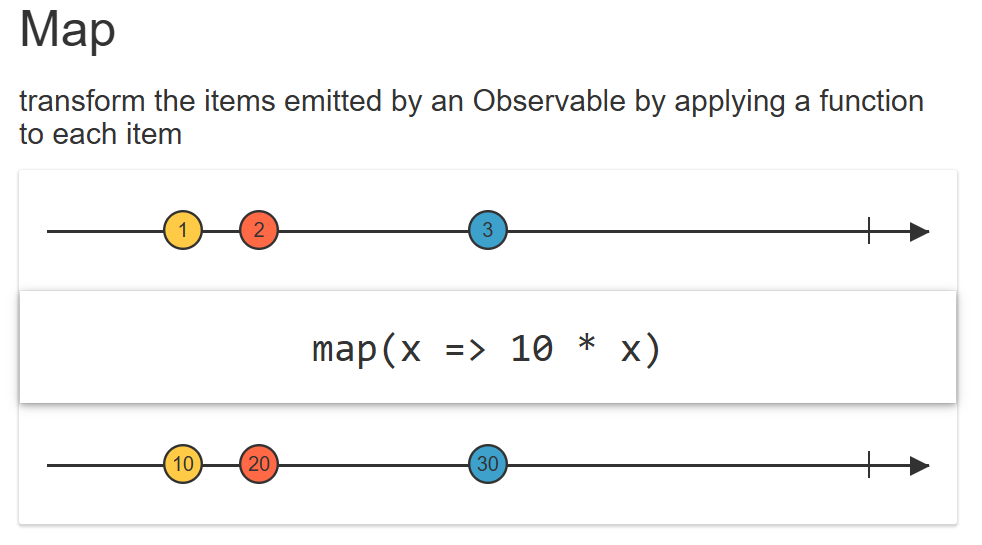

# 📚 Transforming HTTP Response with RxJS `map()` Operator

## 🔍 What You’ll Learn

- How to use RxJS’s `map` operator
- How to transform an HTTP response stream into an array of course objects
- The difference between source and derived observables
- How to extract and reuse code using a utility function
- The benefits of using operators like `map` in real-world applications

---

## 📦 Refresher: HTTP Observable

In the previous lesson, we created a **custom Observable** using the browser’s `fetch()` API to retrieve course data.

```ts
export function createHttpObservable(url: string) {
  return new Observable((observer: Observer<Response>) => {
    fetch(url)
      .then((response) => response.json())
      .then((body) => {
        observer.next(body);
        observer.complete();
      })
      .catch((err) => observer.error(err));
  });
}
```

---

## 🧠 What is the `map()` Operator?

RxJS's `map()` operator is used to **transform values** emitted by an observable.



Each value emitted by the source observable is transformed using the provided function.

---

## 🧪 Use Case: Extracting Courses from API Response

The response from `/api/courses` contains a `payload` object. We want to **extract and convert it into an array** of course objects.

### 📥 Response Structure (Example)

```json
{
  "payload": {
    "1": { "id": 1, "description": "RxJS Basics" },
    "2": { "id": 2, "description": "Advanced Angular" }
  }
}
```

---

## 💡 Transforming Response with `map()`

```ts
const http$ = createHttpObservable("/api/courses");

const courses$ = http$.pipe(
  map((res) => Object.values(res["payload"])) // convert payload object to array
);
```

- `http$`: emits the full response with `payload`.
- `courses$`: emits only the array of courses.

---

## 💬 Subscribe to the Transformed Stream

```ts
courses$.subscribe(
  (courses) => console.log("courses", courses), // array of course objects
  noop,
  () => console.log("Completed")
);
```

- Logs array of course objects.
- `noop` (from RxJS) is a placeholder function for errors.
- Logs “Completed” when the observable completes.

---

## 🧩 Code Organization

### 🛠 `utils.ts`

```ts
import { Observable, Observer } from "rxjs";

export function createHttpObservable(url: string) {
  return new Observable((observer: Observer<Response>) => {
    fetch(url)
      .then((res) => res.json())
      .then((body) => {
        observer.next(body);
        observer.complete();
      })
      .catch((err) => observer.error(err));
  });
}
```

### 🧾 `component.ts`

```ts

import { noop } from "rxjs";
import { createHttpObservable } from "../common/util";
import { map } from "rxjs/operators";

ngOnInit() {
    const http$ = createHttpObservable("/api/courses");

    const courses$ = http$.pipe(
      map((res) => Object.values(res["payload"])) // extract courses
    );

    courses$.subscribe(
      (courses) => console.log("courses", courses),
      noop,
      () => console.log("Completed")
    );
  }
```

---

## ✅ Summary

| Concept            | Explanation                                             |
| ------------------ | ------------------------------------------------------- |
| `map()`            | Transforms values from one observable into another      |
| Derived Observable | `courses$` is derived from `http$` using `map()`        |
| `pipe()`           | Used to chain RxJS operators                            |
| `Object.values()`  | Converts payload object into an array of values         |
| Reusability        | `createHttpObservable()` placed in `utils.ts` for reuse |


