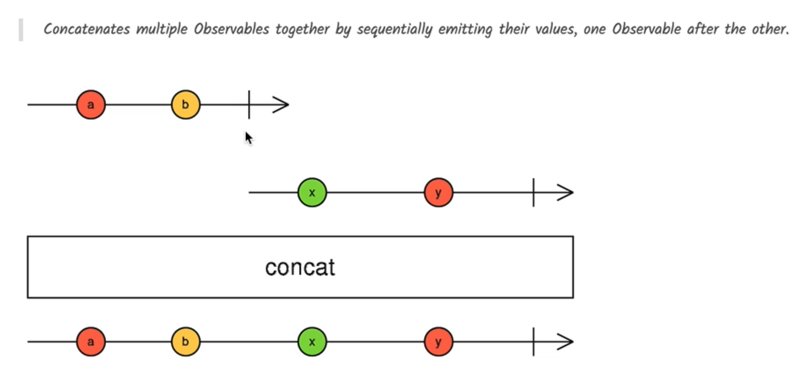

# 📘 RxJS `concat` Operator Explained

> **Goal**: Understand how to sequentially combine multiple Observables using `concat()` and why it's useful.

---

## 🧠 What is `concat`?

The `concat()` operator in RxJS allows you to **sequentially combine multiple Observables**, one after the other.

### 🔑 Key Concept:

> `concat` subscribes to the next Observable **only after** the previous one **completes**.

---

## 📊 Marble Diagram



### 🔍 What it shows:

- Observable 1 emits `a → b → complete`
- Observable 2 emits `x → y → complete`
- Result Observable emits: `a → b → x → y → complete`

---

## 🧪 Code Example

```ts
 ngOnInit() {
    const source1$ = of(1, 2, 3);
    const source2$ = of(4, 5, 6);
    const source3$ = of(7, 8, 9);

    const result$ = concat(source1$, source2$, source3$);

    result$.subscribe(console.log);
  }
```

---

## 🔁 Behavior of `concat()`

- First emits: `1, 2, 3` from `source1$`
- Once `source1$` **completes**, then:
- Emits: `4, 5, 6` from `source2$`
- Then: `7, 8, 9` from `source3$`

---

## ⚠️ Important Rule

> **If any Observable in the chain never completes, `concat()` will never move to the next one.**

### Example:

```ts
import { interval, of, concat } from "rxjs";

const infinite$ = interval(1000); // Never completes
const next$ = of("A", "B", "C");

concat(infinite$, next$).subscribe(console.log); // 'A', 'B', 'C' will NEVER be printed
```

---

## 💼 Real-World Use Case

While `concat()` is useful for basic sequential combining, its **real strength shines** when used with higher-order operators like:

### 🔹 `concatMap()`

> Transforms and concatenates Observables **dynamically**, used for HTTP request chaining.

---

## ✅ Summary

| Feature                   | Behavior                       |
| ------------------------- | ------------------------------ |
| Order of execution        | Sequential                     |
| Depends on completion     | ✅ Yes                         |
| Use for static streams    | ✅ Good fit                    |
| Use with infinite streams | ❌ Not recommended             |
| Combinable with           | `of`, `interval`, `from`, etc. |
