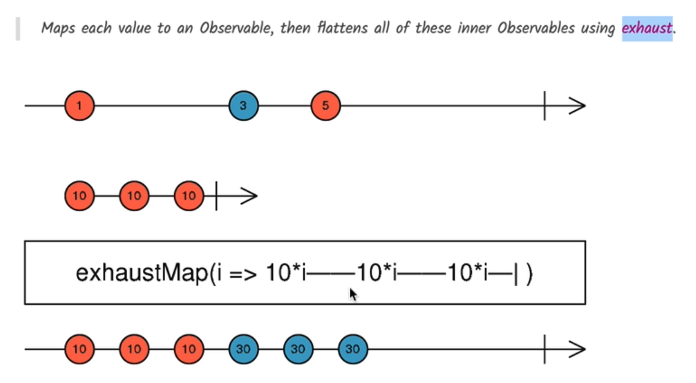

# 🚫 RxJS `exhaustMap` – Ignore While Active

## 💡 What is `exhaustMap`?

`exhaustMap` is a mapping operator in RxJS that **ignores incoming values** from the source observable **while a previous inner observable is still active**.

It is perfect for situations where:

* You want to **ignore rapid duplicate user interactions** (like button mashing).
* You want to **prevent parallel executions** of the same logic (like form saves).
* You want to **process only the first trigger** until it's done, and **ignore others until completion**.

---

## 🔬 Marble Diagram




---

## ✅ Real-World Use Case

### 🔄 The Problem

In an Angular form with a **Save** button:

```html
<button mat-raised-button color="primary" #saveButton (click)="save()">Save</button>
```

If a user clicks the **Save** button multiple times rapidly, it may:

* Send **multiple parallel HTTP requests**.
* Overload the backend.
* Result in **race conditions** or duplicate data.

---

### 🛠️ The Solution

Use `exhaustMap` to **ignore repeated clicks** while the current save operation is still ongoing.

```ts
@ViewChild("saveButton", { static: true, read: ElementRef })
saveButton: ElementRef;

ngAfterViewInit() {
  fromEvent(this.saveButton.nativeElement, "click")
    .pipe(
      exhaustMap(() => this.saveCourse(this.form.value))
    )
    .subscribe();
}

saveCourse(changes) {
  return fromPromise(
    fetch(`/api/courses/${this.course.id}`, {
      method: "PUT",
      body: JSON.stringify(changes),
      headers: {
        "content-type": "application/json",
      },
    })
  );
}
```

---

## 🔍 Why Not `mergeMap` or `concatMap`?

| Operator     | Behavior                                                                                                                  |
| ------------ | ------------------------------------------------------------------------------------------------------------------------- |
| `mergeMap`   | Executes **all** saves in **parallel**. ⚠️ Risk of race conditions.                                                       |
| `concatMap`  | Executes saves **sequentially**, waiting for each to finish. ✅ Order kept. ❌ Can queue up too many if clicked fast.       |
| `exhaustMap` | Executes **first**, then **ignores the rest** until the first completes. ✅ Best for user interaction (e.g., Save button). |

---

## 🔐 Summary

| Operator     | Saves in Parallel? | Ignores Extra While Active? | Use Case                 |
| ------------ | ------------------ | --------------------------- | ------------------------ |
| `mergeMap`   | ✅ Yes              | ❌ No                        | Fetch multiple endpoints |
| `concatMap`  | ❌ No               | ❌ No                        | Sequential saving        |
| `exhaustMap` | ❌ No               | ✅ Yes                       | Prevent duplicate clicks |

---

## 💬 Final Thoughts

Use `exhaustMap` for:

* **Button click events** where only one request should be sent.
* **Login buttons**, **save actions**, or **any user interaction** where duplicate actions must be avoided.
* **Throttling** execution without introducing delay logic.

