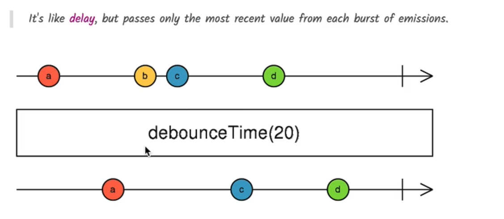

# 🔍 RxJS Typeahead with `debounceTime` & `distinctUntilChanged`

## 🧠 What Are We Building?

We're building a **Typeahead search input** (like Google Search) using RxJS. Our goals:

- Stream user input as observables.
- Avoid sending a request on every key press.
- Filter out duplicate entries and only act on "stable" input.

---

## 🧪 Use Case: Search Input Box

HTML:

```html
<input matInput placeholder="Type your search" #searchInput autocomplete="off" />
```

---

## 🎯 Goal

We want to:

- **Throttle rapid input** so that we don’t hit the backend for every keystroke.
- **Prevent duplicate searches** if the user types the same text.
- **Prepare for an HTTP search** that cancels previous requests when the user keeps typing.

---

## 📦 RxJS Code

```ts
import { AfterViewInit, Component, ElementRef, OnInit, ViewChild } from "@angular/core";
import { fromEvent, Observable } from "rxjs";
import { debounceTime, distinctUntilChanged, map } from "rxjs/operators";

@Component({
  selector: "app-course",
  templateUrl: "./course.component.html",
})
export class CourseComponent implements OnInit, AfterViewInit {
  @ViewChild("searchInput", { static: true }) input: ElementRef;

  ngAfterViewInit() {
    fromEvent<any>(this.input.nativeElement, "keyup")
      .pipe(
        map((event) => event.target.value),
        debounceTime(400), // Wait for 400ms pause in typing
        distinctUntilChanged() // Ignore if next value is same as previous
      )
      .subscribe(console.log); // Will print only "stable", non-duplicate values
  }
}
```

---

## 🛠 Operator Breakdown

| Operator                 | Purpose                                                                |
| ------------------------ | ---------------------------------------------------------------------- |
| `fromEvent`              | Converts DOM events (like `keyup`) into an observable                  |
| `map(event => value)`    | Extracts text value from the input field                               |
| `debounceTime(400)`      | Waits 400ms after last keyup to emit the value (avoids rapid requests) |
| `distinctUntilChanged()` | Prevents emitting duplicate values consecutively                       |

---

## ✅ Output Example

When the user types `Hello`, fast:

- Only `Hello` will be logged.
- No intermediate values (`H`, `He`, `Hel`, etc.) are emitted.

---

## 🧠 Why Use These?

Without these operators:

- Every keystroke causes an API call → ⚠️ high server load.
- Duplicate characters typed quickly → ⚠️ unnecessary duplicate requests.

With them:

- Efficient & clean UX.
- Only meaningful and stable input is used.

---

## 📊 Marble Diagram



This image visually explains how the `debounceTime(20)` operator works in **RxJS**.

---

### 🔍 What the Image Shows

- **Top line:** Represents the **source Observable** emitting values: `a`, `b`, `c`, `d`.
- **Middle box:** Shows the RxJS operator being applied: `debounceTime(20)`
- **Bottom line:** Represents the **output Observable** after applying `debounceTime`.

---

### 🧠 Concept Breakdown

#### 🕒 debounceTime(milliseconds)

- Waits for a pause of the given time (here, **20 milliseconds**) before **emitting the latest value**.
- If a new value arrives **before** the timeout finishes, the previous value is discarded.

---

### ✅ What Happens Here

| Emitted | Behavior                                        | Output |
| ------- | ----------------------------------------------- | ------ |
| `a`     | No value comes after it for 20ms → ✅ emitted   | ✅ `a` |
| `b`     | Followed quickly by `c` (< 20ms) → ❌ discarded | ✖️     |
| `c`     | No value comes within 20ms → ✅ emitted         | ✅ `c` |
| `d`     | No value comes after it → ✅ emitted            | ✅ `d` |

---

### 💡 Summary

> `debounceTime(20)` allows only the **last value in a burst** of quick emissions to pass, and **only if no new value** is emitted during the wait time.

It’s **ideal for typeahead search** and input handling to:

- Reduce noise
- Avoid spamming backend
- Improve performance

Let me know if you'd like similar diagrams for `distinctUntilChanged` or `switchMap` too!
