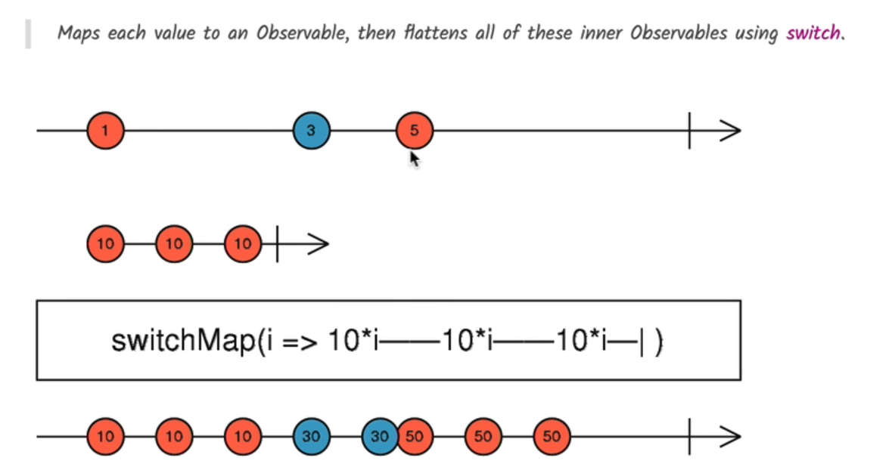

# 🎯 Advanced RxJS Operators in Angular: `switchMap` and `concat`

---

## 🔄 `switchMap`: Switching Inner Observables with Cancellation

### 📘 In Code

```ts
switchMap((search) => this.loadLessons(search));
```

### ✅ What It Does

- Transforms each **search input** into an HTTP request observable.
- If a **new input comes** before the previous request completes, **it cancels** the ongoing request.
- Ideal for **live search** to avoid outdated or overlapping backend calls.

---

### 💡 Real-World Example

> Imagine you're typing in a search box quickly: `"h" → "he" → "hel" → "hell" → "hello"`
> Instead of sending 5 backend calls, only the **last request for "hello"** is processed.

---

### 🎓 Another Example (Custom)

```ts
fromEvent(inputEl, "input").pipe(
  debounceTime(300),
  distinctUntilChanged(),
  switchMap((query) => this.http.get(`/api/products?search=${query}`))
);
```

### 💥 Why Not `concatMap` or `mergeMap`?

| Operator       | Behavior                         | Issue in Live Search    |
| -------------- | -------------------------------- | ----------------------- |
| `concatMap`    | Queues all requests sequentially | Slow & outdated results |
| `mergeMap`     | Runs all requests concurrently   | Backend overload        |
| ✅ `switchMap` | Cancels outdated requests        | ✔ Best for typeahead UX |

---

## ➕ `concat`: Sequential Combination of Observables

### 📘 In Your Code

```ts
this.lessons$ = concat(initLessons$, searchLesson$);
```

### ✅ What It Does

- Emits the result of `initLessons$` **first** (on page load)
- Once completed, it **starts** listening to `searchLesson$`
- Useful to show **initial data first**, then allow interaction.

---

## 🧭 Operator Flow Overview

```text
User Types → fromEvent → map → debounceTime(400ms) → distinctUntilChanged
                                                               ↓
                                                  switchMap(loadLessons)
                                                               ↓
                                                  Lessons Observable
```

On Init:

```text
Component Init → loadLessons()
                   ↓
        concat(initLessons$, searchLesson$) → lessons$
```

---

## 📊 Marble Diagram (Described Visually)

### switchMap (Visualization)



- Each input (a, b, c) triggers a new inner observable.
- When `c` arrives, `b` is canceled.
- Only latest value is processed.

---

### concat (Visualization)

```text
initLessons$:    ----A----
searchLesson$:         -----B----C----
                            ↓     ↓
concat output:     ----A--------B----C----
```

- `initLessons$` emits and completes.
- Then `searchLesson$` begins.

---

## ✅ Benefits of This Approach

| Feature                       | Technique / Operator         | Why It Matters                           |
| ----------------------------- | ---------------------------- | ---------------------------------------- |
| Initial data load             | `loadLessons()` + `concat`   | Page loads with default unfiltered data  |
| Live search optimization      | `debounceTime` + `switchMap` | Limits backend hits; reduces noise       |
| Prevent duplicate queries     | `distinctUntilChanged()`     | Avoids multiple HTTP calls for same term |
| Cancels outdated searches     | `switchMap()`                | Frees up backend, saves network load     |
| Composable and readable logic | `pipe(...)` with RxJS        | Clean code with declarative operators    |

---

## 🧠 Summary

By combining `switchMap`, `concat`, and supportive operators like `debounceTime`, `map`, and `distinctUntilChanged`, you build a **powerful, clean, and reactive** Angular application that:

- Loads data smartly on init
- Responds instantly but efficiently to user input
- Avoids unnecessary or stale backend calls

---
