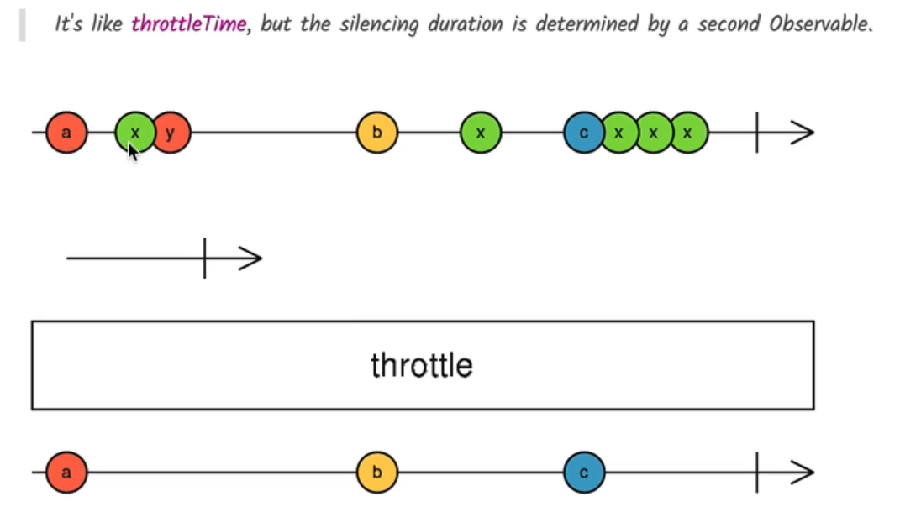

## 🔁 Throttle vs Debounce: A Simple Analogy

> Imagine you’re sending emails whenever someone types in a search bar.

- **Debounce**: Wait until the person has stopped typing for _X milliseconds_ before sending.
- **Throttle**: Allow only one email every _X milliseconds_, no matter how much they type.

---

## 🧪 Code Comparison

### 🔸 Throttle example

```ts
fromEvent<any>(this.input.nativeElement, "keyup")
  .pipe(
    map((event) => event.target.value),
    throttle(() => interval(500)) // OR use throttleTime(500)
  )
  .subscribe(console.log);
```

- **Throttle** emits the **first value**, then **ignores subsequent values for 500ms**.
- **Useful for** limiting how often a function runs (e.g., scroll events, mouse move).
- Doesn't care if user stops typing — just regulates the **rate** of emissions.

### 🔸 Debounce

```ts
fromEvent<any>(this.input.nativeElement, "keyup")
  .pipe(
    map((event) => event.target.value),
    debounceTime(500)
  )
  .subscribe(console.log);
```

- **Debounce** waits **until 500ms have passed without a new event**, then emits **only the last value**.
- **Useful for** search inputs — only fetch results when user pauses typing.
- Avoids unnecessary calls.

---

## 📊 Marble Diagram Comparison

Let's say a user types quickly: `a`, `b`, `c`, `d`, `e`

### 🧵 Debounce (`debounceTime(500)`)


- Emits only after 500ms silence — only `e` is emitted.

### 🧵 Throttle (`throttleTime(500)`)



- Emits `a` immediately, ignores next inputs for 500ms, then emits `d`, etc.

---

## 📌 When to Use Which?

| Use Case                         | Use `debounceTime`              | Use `throttleTime`                 |
| -------------------------------- | ------------------------------- | ---------------------------------- |
| Typeahead / Search input         | ✅ Yes (avoid flooding backend) | 🚫 No (might miss last characters) |
| Scroll events                    | 🚫 No                           | ✅ Yes (limit scroll tracking)     |
| Mouse movement or drag events    | 🚫 No                           | ✅ Yes                             |
| Button rapid clicks (rate limit) | ✅ Yes (limit actions)          | ✅ Yes                             |

---

## ✅ Summary

| Feature           | Debounce           | Throttle                  |
| ----------------- | ------------------ | ------------------------- |
| Emits             | After wait/silence | Immediately, then waits   |
| Ideal For         | Search, form input | Scroll, mousemove, resize |
| Emits last value  | ✅ Yes             | ❌ Not always             |
| Emits first value | ❌ No (waits)      | ✅ Yes                    |

---

## 🔧 Your Final Takeaway

- For **live search**: use `debounceTime`
- For **scroll or resize optimizations**: use `throttleTime`
