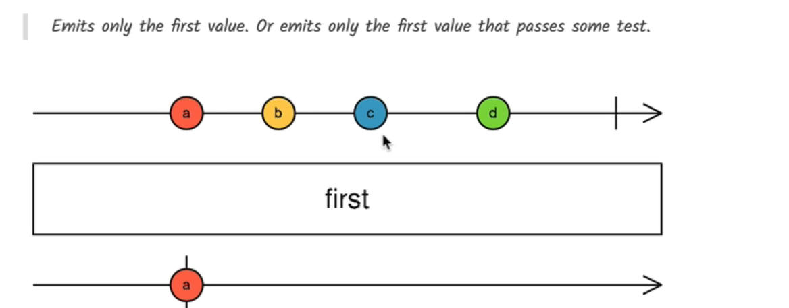
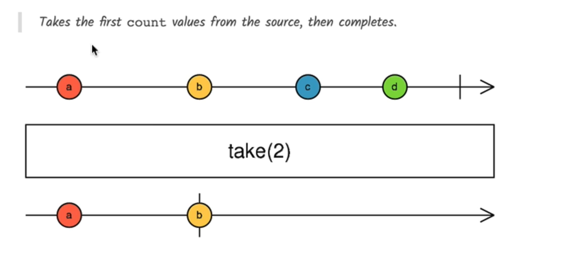

Sure! Here's a clean, professional documentation-style file explaining **`first()`** and **`take()`** RxJS operators, complete with **marble diagrams**, **code examples**, and detailed explanations. You can use this for team documentation, training, or tutorials.

---

# 📘 RxJS Operators: `first()` vs `take()`

---

## 🧠 Introduction

In RxJS, **filtering operators** are used to control what values an observable emits. Two important operators in this category are:

- `first()`: Emits only the first value (optionally matching a condition).
- `take(n)`: Emits the first **n** values and completes.

They’re similar in that both **limit emissions**, but they differ in power and flexibility.

---

## 🎯 1. `first()` Operator

### 📌 Description

The `first()` operator emits **only the first value** emitted by the source observable, then **completes**. It can also take:

- A **predicate** (filter condition),
- A **default value** (used if no match is found).

---

### 🧪 Syntax

```ts
first(predicate?: Function, defaultValue?: any)
```

---

### 🧬 Marble Diagram

```
Source:    ---a---b---c---d---|
first():   ---a|               (only the first value)
first(x>2):----------c|        (first value matching predicate)
```



---

### 🧪 Example 1: Basic Usage

```ts
import { of } from "rxjs";
import { first } from "rxjs/operators";

of(10, 20, 30)
  .pipe(first())
  .subscribe((val) => console.log("First:", val));
```

**🖨 Output:**

```
First: 10
```

---

### 🧪 Example 2: With Predicate

```ts
of(1, 4, 5)
  .pipe(first((val) => val > 3))
  .subscribe((val) => console.log("First > 3:", val));
```

**🖨 Output:**

```
First > 3: 4
```

---

### 🧪 Example 3: With Predicate & Default

```ts
of(1, 2, 3)
  .pipe(first((val) => val > 10, "No match"))
  .subscribe((val) => console.log("Result:", val));
```

**🖨 Output:**

```
Result: No match
```

---

### ⚠️ Edge Case: No Match and No Default

```ts
of(1, 2, 3)
  .pipe(first((val) => val > 10))
  .subscribe({
    error: (err) => console.error("Error:", err),
  });
```

**🖨 Output:**

```
Error: EmptyError
```

---

## ✅ 2. `take(n)` Operator

### 📌 Description

The `take(n)` operator emits **only the first `n` values** from the source observable, then **automatically completes**. It’s helpful for managing **infinite or long-lived streams**.

---

### 🧪 Syntax

```ts
take(count: number)
```

---

### 🧬 Marble Diagram

```
Source:    ---a---b---c---d---e---|
take(2):   ---a---b|               (takes first 2 values)

Source:    ---1---2---3---4---|
take(0):   |                     (completes immediately, no values)
```



---

### 🧪 Example 1: Basic Usage

```ts
import { of } from "rxjs";
import { take } from "rxjs/operators";

of("A", "B", "C", "D")
  .pipe(take(2))
  .subscribe((val) => console.log("Take:", val));
```

**🖨 Output:**

```
Take: A
Take: B
```

---

### 🧪 Example 2: With `interval()`

```ts
import { interval } from "rxjs";
import { take } from "rxjs/operators";

interval(1000)
  .pipe(take(3))
  .subscribe((val) => console.log("Interval Take:", val));
```

**🖨 Output over 3 seconds:**

```
Interval Take: 0
Interval Take: 1
Interval Take: 2
```

---

### 🧪 Example 3: `take(0)`

```ts
of(1, 2, 3)
  .pipe(take(0))
  .subscribe({
    next: (val) => console.log(val),
    complete: () => console.log("Completed"),
  });
```

**🖨 Output:**

```
Completed
```

> 🚫 No values are emitted; the stream completes immediately.

---

## 🆚 Comparison Table

| Feature                 | `first()`                           | `take(n)`                |
| ----------------------- | ----------------------------------- | ------------------------ |
| Emits                   | First value (optional condition)    | First **n** values       |
| Optional condition      | ✅ Yes (via predicate)              | ❌ No                    |
| Default value fallback  | ✅ Yes                              | ❌ No                    |
| Automatically completes | ✅ Yes                              | ✅ Yes                   |
| Use Case                | First event or match                | Controlled stream length |
| Error if no match       | ❌ Yes (unless default is provided) | ❌ No                    |

---

## 🎓 When to Use

| Scenario                                      | Recommended Operator |
| --------------------------------------------- | -------------------- |
| You only want the **first value**             | `first()`            |
| You need **n number of values**, then stop    | `take(n)`            |
| You want to **wait for a condition**, once    | `first(predicate)`   |
| Avoiding **infinite observable memory leaks** | `take()`             |

---

## 📁 Summary

- Use `first()` when you:

  - Only need the **first emitted value** (optionally matching a condition).
  - Want an optional default value.
  - Want automatic unsubscribe after first match.

- Use `take(n)` when you:

  - Want the **first N values** and nothing more.
  - Need to cap emissions from infinite or long streams.

---

Would you like this as a downloadable `.pdf` or `.md` document with diagrams included?
