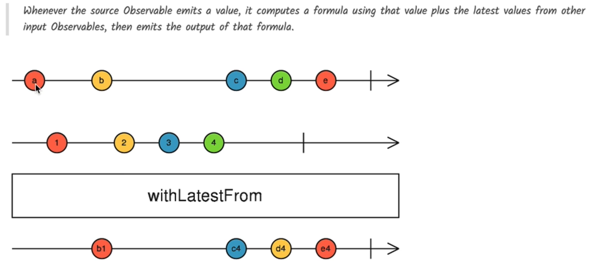

# 📘 RxJS Operator: `withLatestFrom`

---

## 🔍 What is `withLatestFrom`?

`withLatestFrom` is a **combination operator** in RxJS that allows you to **combine values** from the **source observable** with the **latest values** from one or more **other observables** **at the time the source emits**.

> Think of it like: “When **I** emit, grab the **latest value** from them and combine.”

---

## 🧬 Marble Diagram

### 📊 Diagram Explanation

```
Source$:     ----a-------b--------c--------|
Other$:      --1----2-----------3------4---|

Result$:     ----[a,2]---[b,2]---[c,3]------|
```

### Key Behavior:

- `Source$` triggers the emission.
- `Other$` provides the **latest value** available at that point.
- The output emits **\[sourceValue, latestOtherValue]**.
- It **doesn’t emit until the other observable has emitted at least once**.

## 

## ⚙️ Syntax

```ts
source$.pipe(withLatestFrom(other$));
```

---

## 🧪 Example: Real-World Use Case

```ts
import { fromEvent, interval } from "rxjs";
import { withLatestFrom, map, take } from "rxjs/operators";

// Simulate a user click (source)
const clicks$ = fromEvent(document, "click");

// Simulate live counter (other observable)
const interval$ = interval(1000).pipe(take(10));

// Combine: when user clicks, get latest interval value
clicks$
  .pipe(
    withLatestFrom(interval$),
    map(([click, counter]) => `Click at count: ${counter}`)
  )
  .subscribe(console.log);
```

> ✅ Each click emits the **latest value from the interval**, like:

```
Click at count: 3
Click at count: 5
Click at count: 8
```

---

## 🧪 Example: Simple Numeric

```ts
import { of, interval } from "rxjs";
import { withLatestFrom, take } from "rxjs/operators";

const source$ = interval(1000).pipe(take(3)); // 0, 1, 2
const other$ = of("A", "B", "C");

source$.pipe(withLatestFrom(other$)).subscribe(([s, o]) => console.log("Result:", s, o));
```

> 📌 Since `of()` completes instantly, `other$` emits only `'C'` by the time `source$` emits its first value.

---

## 🧠 Key Notes

| Behavior                       | Description                                    |
| ------------------------------ | ---------------------------------------------- |
| Triggers on                    | Emission of **source observable**              |
| Combines with                  | Latest value(s) from **other observables**     |
| Emits                          | `[sourceVal, latestOtherVal]` or mapped result |
| Requires other\$ to emit first | ✅ Yes, or no value will be emitted            |
| Completes when                 | Source completes                               |

---

## 🧪 Common Use Cases

| Use Case                              | Why `withLatestFrom` is Useful         |
| ------------------------------------- | -------------------------------------- |
| On button click, use latest form data | Combine UI event with form state       |
| On API retry, use latest token        | Combine retry trigger with auth stream |
| On scroll, use latest scroll position | Combine events with current metrics    |

---

## 🆚 `combineLatest()` vs `withLatestFrom()`

| Feature                    | `combineLatest()`         | `withLatestFrom()`                             |
| -------------------------- | ------------------------- | ---------------------------------------------- |
| Emits on                   | Any observable emits      | Only **source** emits                          |
| Requires initial emissions | ✅ Yes from all           | ✅ Only from **others**, then waits for source |
| Use case                   | Merge **latest from all** | Sync with latest data on **source trigger**    |

---

---

## More Example

```ts
this.loadLessons()
      .pipe(withLatestFrom(this.course$))
      .subscribe(([lessons, course]) => {
        console.log("lessons", lessons);
        console.log("course", course);
      });
  }
```

---

## 📁 Summary

- `withLatestFrom` allows **on-demand combination**: it listens for source emissions and **pulls the latest values** from others.
- It’s perfect for syncing data streams with **user actions**, **timers**, or **state observables**.

---
