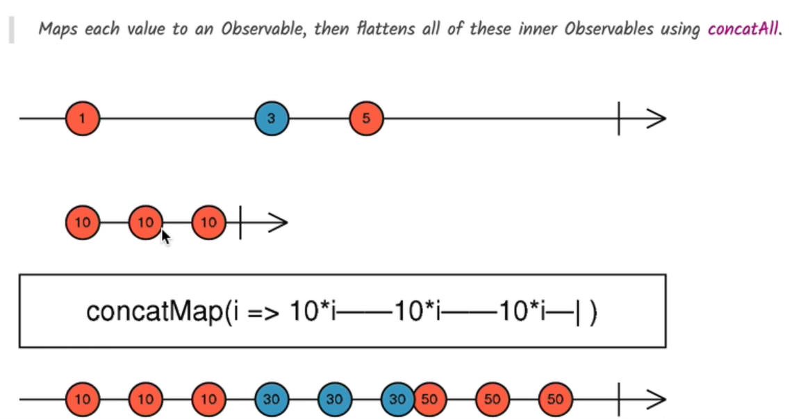

Here is a well-structured and beginner-friendly `.md` file that documents the practical use case of RxJS's `concatMap` operator for **sequential HTTP save operations in Angular forms**:

---

# 🧠 Practical Use Case of RxJS `concatMap` Operator in Angular

## 🎯 Goal

Implement **sequential autosave** for form data using **RxJS `concatMap`**, ensuring that each save request completes before the next one starts.

---

## 📋 Problem Statement

When users type in a form (e.g., editing a course), each keystroke can trigger a save operation. If multiple saves happen **in parallel**, there's no guarantee that the **last saved value** is the **latest**.

---

### ❌ Anti-pattern: Nested Subscriptions

```ts
this.form.valueChanges.pipe(filter(() => this.form.valid)).subscribe((changes) => {
  const saveChanges$ = fromPromise(
    fetch(`/api/courses/${this.course.id}`, {
      method: "PUT",
      body: JSON.stringify(changes),
      headers: {
        "content-type": "application/json",
      },
    })
  );
  saveChanges$.subscribe();
});
```

- Leads to **nested subscriptions**.
- Triggers **multiple parallel** requests.
- Last write may not be the latest.

---

## ✅ Better Solution: `concatMap()`

### 🔁 How `concatMap` Works

It **maps** each emitted value to an **inner observable** (e.g., an HTTP request), but ensures they are **executed sequentially** — each observable **waits for the previous to complete**.

---

## 📊 Marble Diagram



---

## 💻 Refactored Code Example

### `CourseDialogComponent.ts`

```ts
export class CourseDialogComponent implements OnInit {
  ngOnInit() {
    this.form.valueChanges
      .pipe(
        filter(() => this.form.valid),
        concatMap((changes) => this.saveCourse(changes))
      )
      .subscribe(); // No nesting, no parallel saves
  }

  saveCourse(changes): Observable<any> {
    return fromPromise(
      fetch(`/api/courses/${this.course.id}`, {
        method: "PUT",
        body: JSON.stringify(changes),
        headers: {
          "content-type": "application/json",
        },
      })
    );
  }
}
```

---

## ⚙️ Key Operators Used

| Operator        | Purpose                                                          |
| --------------- | ---------------------------------------------------------------- |
| `filter()`      | Only save if the form is valid                                   |
| `concatMap()`   | Ensure HTTP requests are sent one after another, not in parallel |
| `fromPromise()` | Convert fetch call (Promise) into an RxJS Observable             |

---

## ✅ Result

- Sequential save operations.
- No duplicated or out-of-order writes.
- Efficient and reactive design.

---

## 📚 Next Up: `debounceTime`

To reduce the **number of save requests**, we will introduce the `debounceTime()` operator — this will wait until the user pauses typing before saving.

---

## 📌 Summary

| Feature                | Without `concatMap`  | With `concatMap`           |
| ---------------------- | -------------------- | -------------------------- |
| Save order             | ❌ Unreliable        | ✅ Guaranteed              |
| Network load           | ❌ High (parallel)   | ✅ Controlled (sequential) |
| Code style             | ❌ Nested subscribes | ✅ Flat stream chain       |
| Reactive best practice | ❌ Violated          | ✅ Followed                |

---
