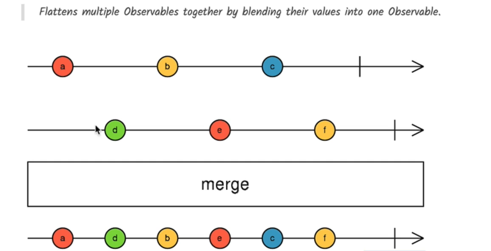
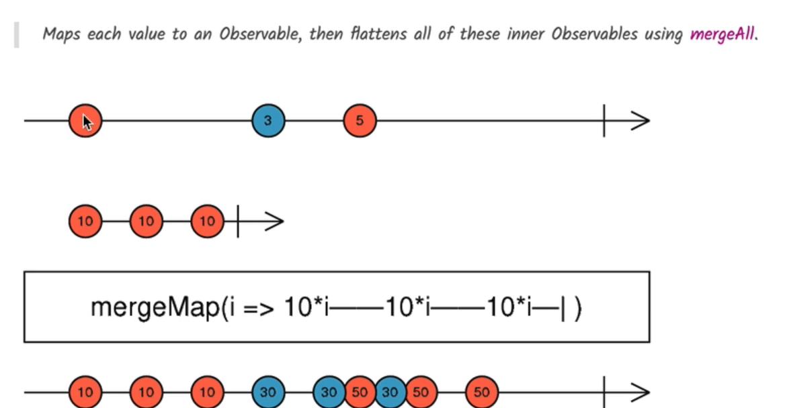

# ⚡ RxJS `merge` and `mergeMap` Operators

## 🧩 What Are They?

- **`merge()`**: Combines multiple observables and emits **all values as they arrive**, subscribing to all of them **immediately**.
- **`mergeMap()`**: Projects each value from a source observable into an **inner observable**, subscribes to **all of them in parallel**, and merges all results into the output observable.

---

## 1️⃣ `merge()` – Combining Observables in Parallel

### ✅ When to Use

- When you want to **combine multiple long-running or interval-based observables**.
- When you want to **subscribe to multiple observables immediately** and get results **as soon as they emit**.

### 🔬 Marble Diagram



### 💻 Code Example

```ts
ngOnInit() {
  const interval$ = interval(1000); // Emits 0, 1, 2... every second

  const interval2$ = interval$.pipe(map(val => val * 10)); // 0, 10, 20...

  const result$ = merge(interval$, interval2$);

  result$.subscribe(console.log); // Interleaved values from both
}
```

---

## 2️⃣ `mergeMap()` – Mapping to Inner Observables in Parallel

### ✅ When to Use

- When you want to **fire multiple asynchronous requests at the same time**.
- Ideal for **parallel HTTP requests**, **websocket events**, etc.
- ⚠️ Not suited for operations where **order matters** (like sequential form saves).

### 🔬 Marble Diagram



Each value creates an observable and all are subscribed to in **parallel**.

---

### 💻 Code Example: Parallel Form Saves (NOT Ordered)

```ts
ngOnInit() {
  this.form.valueChanges
    .pipe(
      filter(() => this.form.valid),
      mergeMap((changes) => this.saveCourse(changes))
    )
    .subscribe();
}

saveCourse(changes) {
  return fromPromise(
    fetch(`/api/courses/${this.course.id}`, {
      method: "PUT",
      body: JSON.stringify(changes),
      headers: { "content-type": "application/json" }
    })
  );
}
```

### 🔥 Result

- All save operations **trigger in parallel**.
- ✅ Faster but ❌ may cause **race conditions** if latest update is overwritten by older ones.

---

## 🧠 Comparison: `concatMap` vs `mergeMap`

| Feature               | `concatMap`                     | `mergeMap`                        |
| --------------------- | ------------------------------- | --------------------------------- |
| Execution Order       | Sequential (waits for previous) | Parallel (does not wait)          |
| Use Case              | Save form data, upload queue    | Fetch multiple resources at once  |
| Output Timing         | Ordered                         | Interleaved                       |
| Observable Completion | Waits per observable            | Doesn’t wait                      |
| Race Condition Risk   | ❌ Low                          | ✅ High (unless managed manually) |

---

## 🧪 Practical Use Cases

### ✅ Use `merge()` When:

- You want to **combine UI streams**, such as clicks, scrolls, and keyups.
- Combine **multiple interval-based observables**.

### ✅ Use `mergeMap()` When:

- You want to **fetch multiple API endpoints** in parallel.
- You need to **process events or tasks simultaneously**.

### ❌ Don't use `mergeMap` when:

- The order of operations **must be preserved** (e.g., save form in order) → Use `concatMap`.

---

## 🔚 Summary

| Operator      | Use Case                                    | Executes In | Preserves Order? | Completion Condition            |
| ------------- | ------------------------------------------- | ----------- | ---------------- | ------------------------------- |
| `merge()`     | Combine streams like click, interval, etc.  | In Parallel | ❌ No            | All source observables complete |
| `mergeMap()`  | Fire multiple HTTP/API requests in parallel | In Parallel | ❌ No            | When source completes           |
| `concatMap()` | Save operations, ordered requests           | In Sequence | ✅ Yes           | When source completes           |
